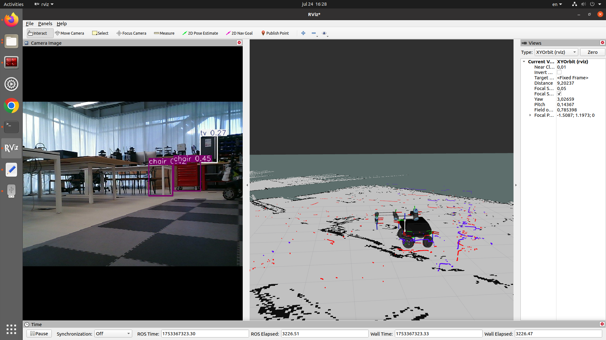
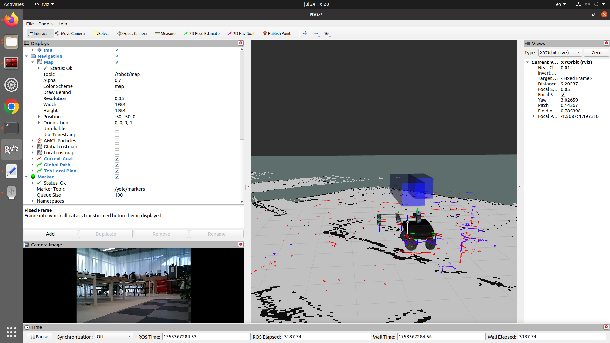

# RB-Vogui-XL

Ce dépôt regroupe les travaux réalisés sur le robot **RB-XL-Vogui** à Polytech Dijon (site du Creusot).

## Structure du projet

Les scripts liés à la détection d’objets via YOLO (You Only Look Once) sont disponibles dans le package ROS suivant :

```bash
cd ~/catkin_ws/src/robot_packages/pkg_transm_cohoma
```

## Utilisation de YOLO

### YOLO 2D

**Lancement :**
```bash
python3 yolo2d.py
```

**Visualisation dans RViz :**
1. Ouvrir RViz :
   ```bash
   rviz
   ```
2. Ajouter un affichage de type **Camera Image**
3. Sélectionner le topic :
   ```
   /yolo/image_annotated
   ```



---

### YOLO 3D

**Lancement :**
```bash
python3 yolo3d.py
```

**Préparation de l'IHM Robotnik :**
1. Accéder à l’IHM du robot :  
   [http://192.168.0.200/robotnik_hmi/index.php](http://192.168.0.200/robotnik_hmi/index.php)
2. Aller dans l’onglet **Control Panel → Localisation Panel**
3. S'assurer que le **Module** est **désactivé** (cliquer sur le bouton **STOP** si nécessaire)

**Visualisation dans RViz :**
1. Ouvrir RViz :
   ```bash
   rviz
   ```
2. Ajouter un affichage de type **Marker**
3. Sélectionner le topic :
   ```
   /yolo/marker
   ```



---

**Lancement :**
```bash
roslaunch pkg_transm_cohoma rtabmap_vogui.launch
```

```bash
rtabmap-databaseViewer /home/robot/.ros/rtabmap.db
```


